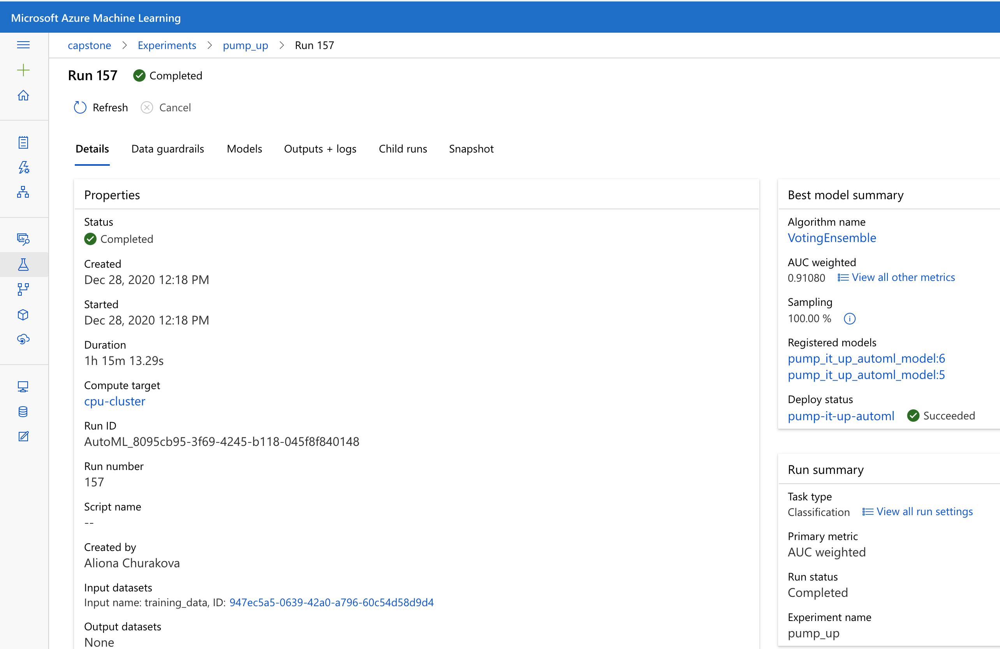
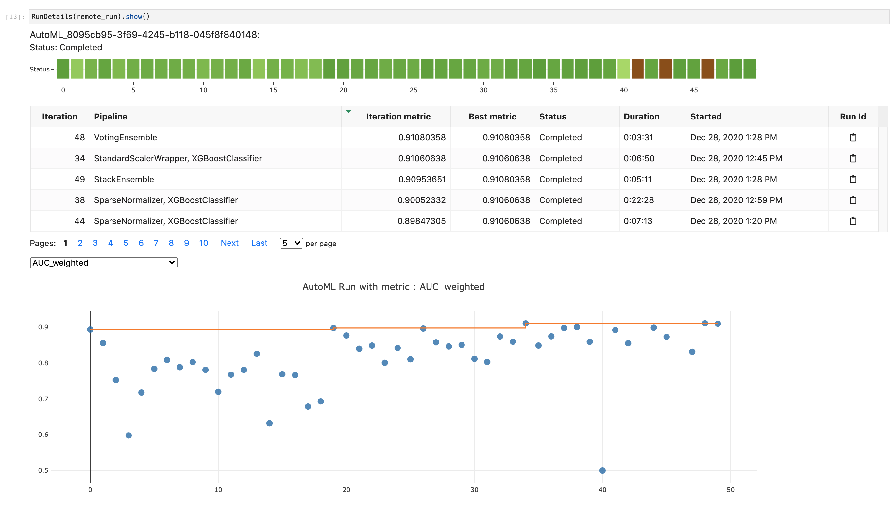
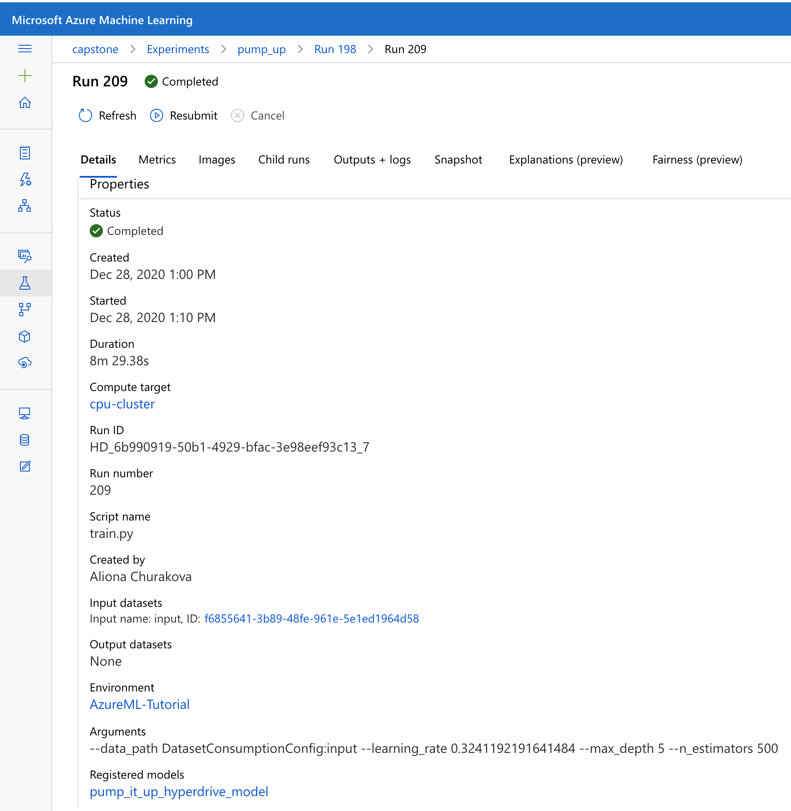
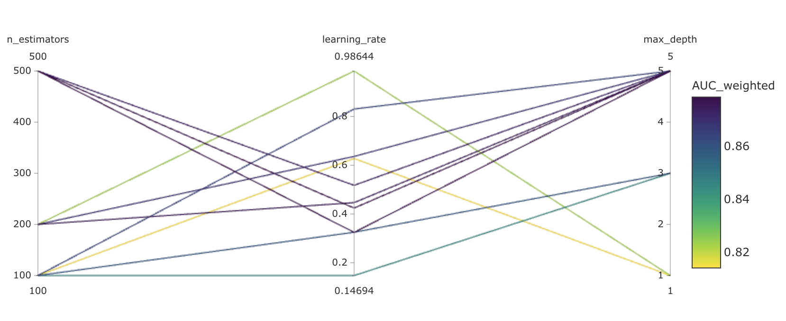
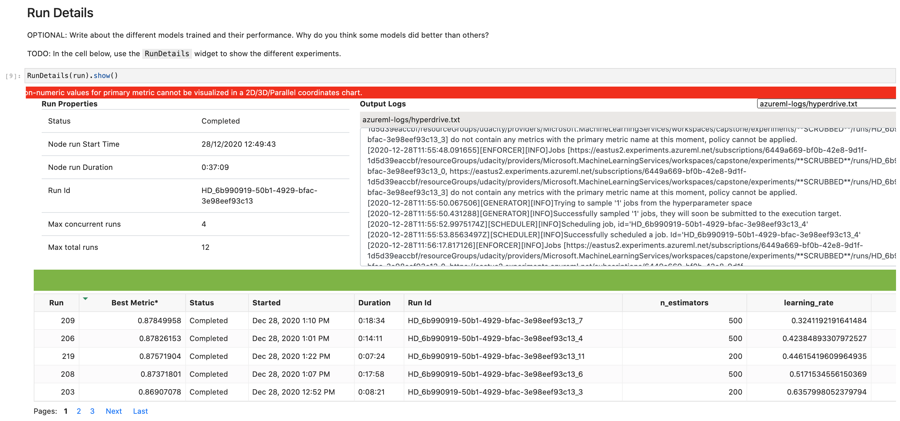
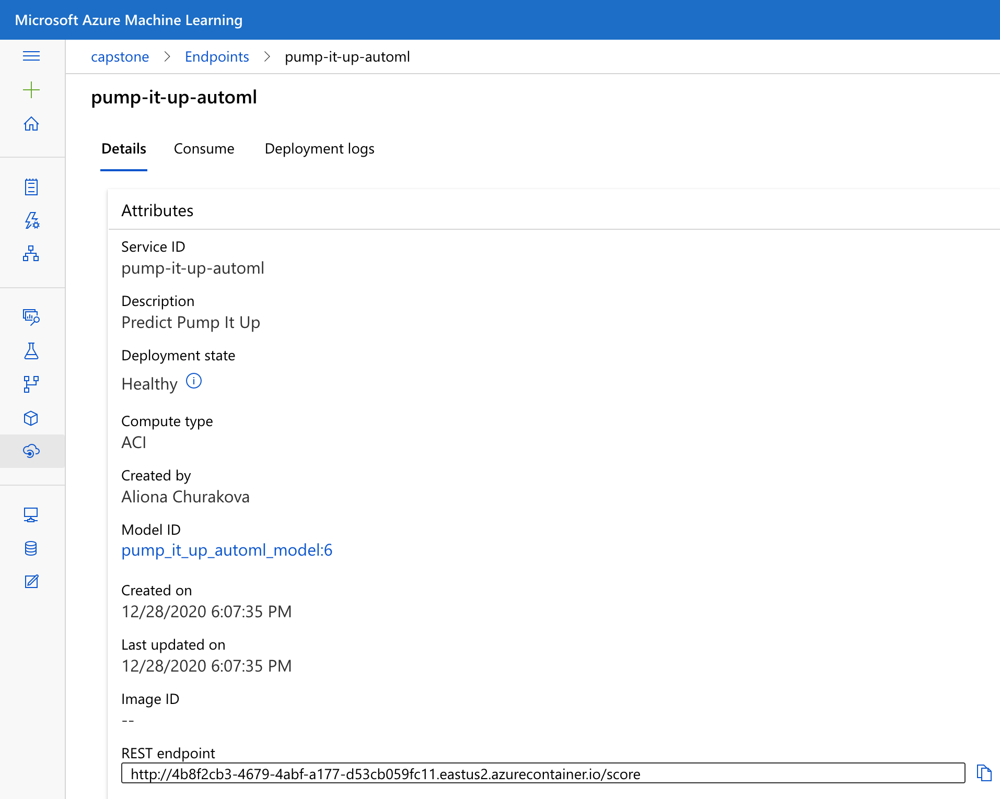

# Azure Machine Learning Engineer Capstone Project

This project shows various capabilities of model training and model deployment on the Azure ML platform. A prediction of the condition of waterpoint is used as an example problem.

## Project prerequisites

* An Azure ML workspace
* A compute instance to run notebooks

All further resources are created programmatically.

## Dataset

### Overview

This project uses the data from a DrivenData competition - [Pump it Up: Data Mining the Water Table](https://www.drivendata.org/competitions/7/pump-it-up-data-mining-the-water-table/).

The training data is divided into two files, with the target variable (labels), and the other variables (values). The target variable describe the functioning state of each waterpoint (*functional*, *functional need repair* and *non functional*). Descriptive variables include pump location, its founder, water quality and quantity, water point type, etc.

### Task

The goal of the project is to provide users with a scoring API that receives input data about waterpoints and predicts its status. Detection of non functional and functional but requiring repair waterpoints allows prioritizing resources for maintenance. 

### Access

Raw as well as pre-processed data was uploaded in Azure datastore and tabular dataset were created from them. The data used for training exists in the form of the registered dataset, which was used to profile and explore the data. Additionally, a file-type dataset was created for training in order to mount it during the HyperDrive run.

## Automated ML

The problem at hand is a multiclass classification (`task = 'classification'`). The fact of unbalanced dataset suggests against the often used accuracy metric. Among the available performance metrics in AutoML classification (see below), the weighted AUC was chosen (`"primary_metric": 'AUC_weighted'`).

Choice of the cloud compute target (`compute_target = cpu_cluster`) allows profiting from higher compute capabilities. Enabling early stopping (`"enable_early_stopping": True`) saves computation time for prospectless children runs. The training data from Datastore with a target variables are also specified within the AutoML configuration (`training_data = ds_joined,
                               label_column_name = "status_group"`).


### Results

A voting ensemble achieved the highest weighted AUC of 0.91. 



Overall, the top models (see the screenshot below) include XGBoost classifiers with different preprocessing of input features.




Basic exploratory data analysis (EDA) was completed by profiling the data in Azure. As a result, some variables are excluded. Deeper EDA and consequent data wrangling are highly recommended as they have a potential to improve model performance. Another potential improvement can be expected from tacking the unbalance nature of the training set.


## Hyperparameter Tuning

Various boosting approaches showed high performance during the AutoML training. This motivated to apply a gradient boosting approach and tune multiple hyperparameters using HyperDrive:

* number of boosting stages (100, 200 or 500)
* learning rate (values between 0.01 and 1)
* maximum depth (1, 3 or 5)

The random search of the parameter space (`RandomParameterSampling`) was chosen for its relative computational efficiency (in comparison to the Bayesian sampling) and the ability to explore the parameter space with both continuous and discrete values. The random sampling is compatible with the early stopping policy (`BanditPolicy`) that has a potential of lowering computation time and costs. The performance metric is evaluated every time the script reports the metric and the Bandit policy is configured to terminate any training runs that are below the calculated value with the slack factor of 0.15 (see details in the [documentation](https://docs.microsoft.com/en-us/python/api/azureml-train-core/azureml.train.hyperdrive.banditpolicy?view=azure-ml-py)). 
A number of runs was configured to 12 (`max_total_runs=12`).

To achieve comparability with the AutoML models, weighted AUC was chosen as the target performance metric (`primary_metric_name='AUC_weighted', primary_metric_goal=PrimaryMetricGoal.MAXIMIZE`).


### Results

The highest weighted AUC of 0.88 was achieved with the following hyperparameters values:

* number of boosting stages: 500
* learning rate: 0.32
* maximum depth: 5



The parallel coordinate chart of model performance with various hyperparameters values (see below) suggest a few hypothesises that are worth evaluating for further model improvement:

* Model performance is not very sensitive to number of boosting stages among the tested values (100, 200 and 500). The higher value tends to show better results and even higher values can be beneficial

* Higher maximum depth seems to be associated with higher performance. Exploration of higher values is recommended.

* Among tested values of learning rate mid-range values show better results. Exploration of a wider range can be beneficial.

Overall, exploration of a larger number of runs, a higher number of hyperparameters and their broader ranges with Bayesian sampling is likely to improve performance. However, as mentioned in the AutoML section, a benefit of EDA and feature engineering tends to be significant.



An overview of the models trained within the HyperDrive show quite similar performance in terms of weighted AUC. 




## Model Deployment

The best AutoML model showed better performance and therefore is it deployed as a web service. 

No authentication is activated on the endpoint, so one requires the URL and the format of the input data to send requests and receive predictions. A working example can be found in the [notebook](automl.ipynb).

Sample input:

```
{
  "data": [
    {
      "amount_tsh": 0,
      "date_recorded": "2013-02-04 00:00:00,000000",
      "funder": "Dmdd",
      "gps_height": 1996,
      "installer": "DMDD",
      "longitude": 35.2907992,
      "latitude": -4.05969643,
      "wpt_name": "Dinamu Secondary School",
      "num_private": 0,
      "basin": "Internal",
      "subvillage": "Magoma",
      "region": "Manyara",
      "region_code": 21,
      "district_code": 3,
      "lga": "Mbulu",
      "ward": "Bashay",
      "population": 321,
      "public_meeting": "True",
      "scheme_management": "Parastatal",
      "scheme_name": "",
      "permit": "True",
      "construction_year": 2012,
      "extraction_type": "other",
      "extraction_type_group": "other",
      "extraction_type_class": "other",
      "management": "parastatal",
      "management_group": "parastatal",
      "payment": "never pay",
      "payment_type": "never pay",
      "water_quality": "soft",
      "quality_group": "good",
      "quantity": "seasonal",
      "quantity_group": "seasonal",
      "source": "rainwater harvesting",
      "source_type": "rainwater harvesting",
      "source_class": "surface",
      "waterpoint_type": "other",
      "waterpoint_type_group": "other"
    }
  ]
}
```
The model was deployed to the Azure Container instance and its overview shows the healthy status, the name of the deployed model and the endpoint URL.


## Screen Recording

This [screen recording](https://youtu.be/yRsvkm0L6RM)  gives a short overview of the project in action.

## Standout Suggestions

Enabled application insights for the scoring endpoint permit extended performance monitoring of the model API. Acting on performance monitoring results can significantly contribute to user experience of the model consumers (e.g. in terms of latency). 

## Future work

Independent of the modelling approach, deeper train data exploration and transformation has a potential to improve predictive performance and generate insights. Examples:

* substitution of non-reliable data (0,0 for latitude/longitude or 0 for the construction year) by missing data

* custom treatment of missing data (e.g. possibly some values are implied by other variables)

* tackle unbalanced data (currently the largest class is represented by over a half of training examples and the smallest class just by 7%)

* determine whether there are variables with (almost) identical information and possibly exclude such close duplicates

It is worth spending more time to reconsider the target performance metric. A conversation with the *owners* of the problem at hand (prediction of waterpoint state) who are also future users of the model could sharpen the understanding of the relevant aspects of model performance. As AutoML has only a limited number of available metrics, a hyperparameter tuning approach could become preferable for this matter.

The hyperparameter tuning approach has a wide range of possibilities to explore further, please refer to the [section above](#hyperparameter-tuning).